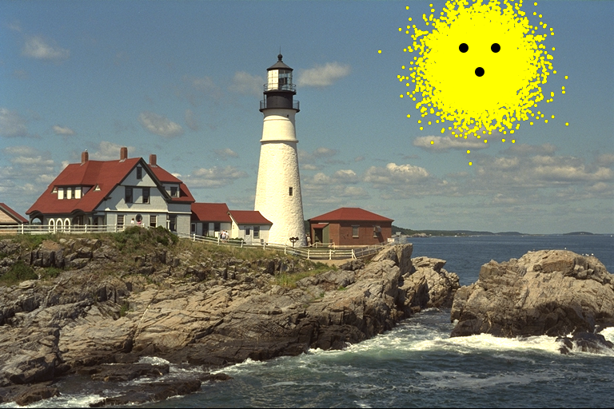

# ImagePlot

[](https://travis-ci.org/rened/ImagePlot.jl)

A very simple package for drawing on top of images, based on work by @cdsousa.


#### Lets draw a sun

```jl
using ImagePlot, TestImages
img = plot(testimage("lighthouse"), 30*randn(2,10000).+[80;600])
img = plot(img, [60 60 90; 580 620 600], radius = 6, fillcolor = "black")
```




